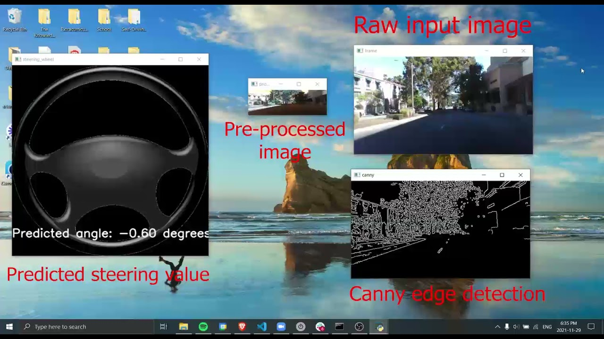

# End 2 end learning

Currently am focusing on taking in monocular camera inputs and generating steering + brake (fully end2end)

<a href="https://twitter.com/srianumakonda/status/1465469834431447040">Here's a tweet</a> about my progress right now (work still in progress).

[(https://youtu.be/vPxW7LrYtUU)